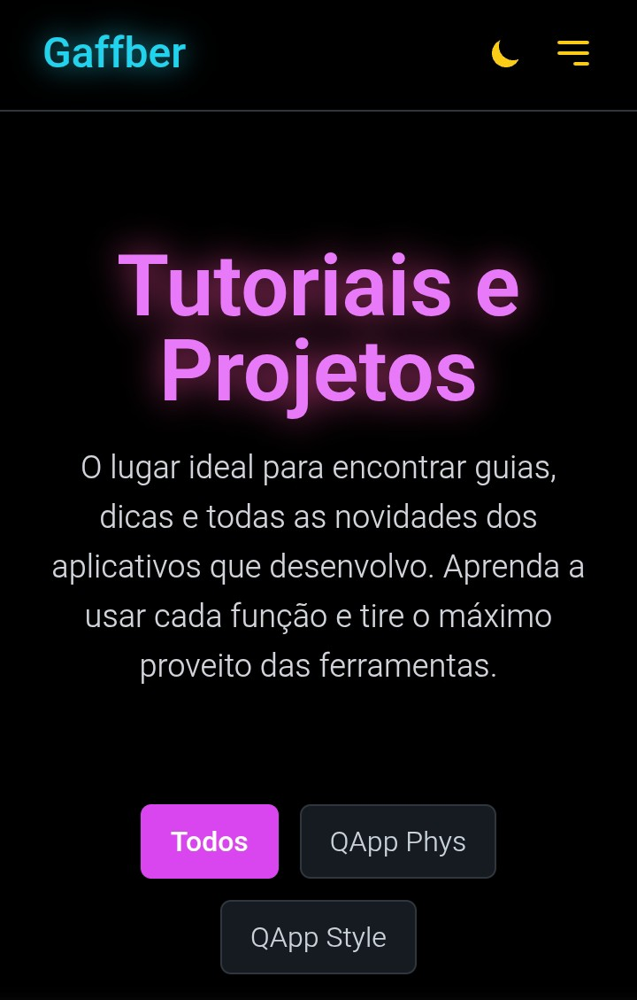

# Website - Gaffber  
  

Este é o repositório do meu website pessoal, desenvolvido como um site estático para apresentar meus projetos de aplicativos e tutoriais.  
O site está hospedado no GitHub Pages e foi construído com foco em um design limpo, responsivo e com funcionalidades modernas.  

**➡️ [Acessar o Site Ao Vivo](https://gffbr.github.io/website)**  

---

## ✨ Funcionalidades  

O site conta com uma série de funcionalidades implementadas para melhorar a experiência do usuário:

* **🎨 Tema Dinâmico:** Alternância entre modo claro (Light) e escuro (Dark), com a preferência do usuário salva no navegador.
* **📱 Design Responsivo:** Interface totalmente adaptável para desktops, tablets e smartphones.
* **🌐 Tradução de Idiomas:** Popup customizado com busca para tradução instantânea da página em dezenas de idiomas através do Google Translate.
* **📂 Filtro de Categorias:** Os artigos na página inicial podem ser filtrados por categoria de forma dinâmica.
* **🔢 Paginação Inteligente:** A lista de artigos é paginada automaticamente para manter a organização, mesmo com muitos posts.
* **🔗 Menu de Navegação:** Navegação principal e menu mobile para acesso rápido às seções do site.
* **📋 Botão de Copiar Código:** Funcionalidade para copiar trechos de código dos tutoriais com um único clique (quando aplicável).

---

## 🛠️ Tecnologias Utilizadas  

Este projeto foi construído utilizando as seguintes tecnologias web:

* **HTML5**
* **CSS3**
* **Tailwind CSS** (utilizado via CDN para estilização rápida)
* **JavaScript** (Vanilla JS, sem frameworks)

---

## 🚀 Como Executar Localmente  

Por ser um site estático, não há necessidade de um servidor ou dependências complexas.  
Para executar este projeto localmente:

1. Clone ou baixe este repositório:
    ```sh
    git clone https://github.com/GFFBR/website.git
    ```
2. Navegue até a pasta do projeto.
3. Abra o arquivo `index.html` em qualquer navegador de internet.

---

## 📝 Direitos Autorais  

© 2025 Gaffber. Todos os direitos reservados.  
Este projeto está licenciado sob a GNU Affero General Public License v3.0. Qualquer uso, modificação ou redistribuição deve respeitar os termos da AGPL. Uso corporativo está sujeito às exigências da AGPL quanto à disponibilização do código-fonte.
Nenhum uso, redistribuição, modificação ou cópia autorizada sem permissão expressa.  
Qualquer tentativa de derrubar, copiar, reproduzir, imitar ou atacar esta página está sujeita a medidas legais, civis ou criminais, conforme a legislação vigente.

---

## 📫 Contato  

Desenvolvido por **Gaffber**.

* **Email:** gaffber@gmail.com  
* **GitHub:** [GFFBR](https://github.com/GFFBR)
